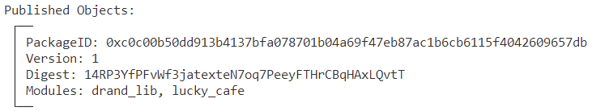
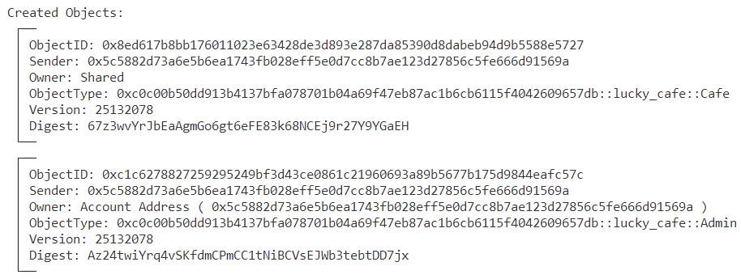
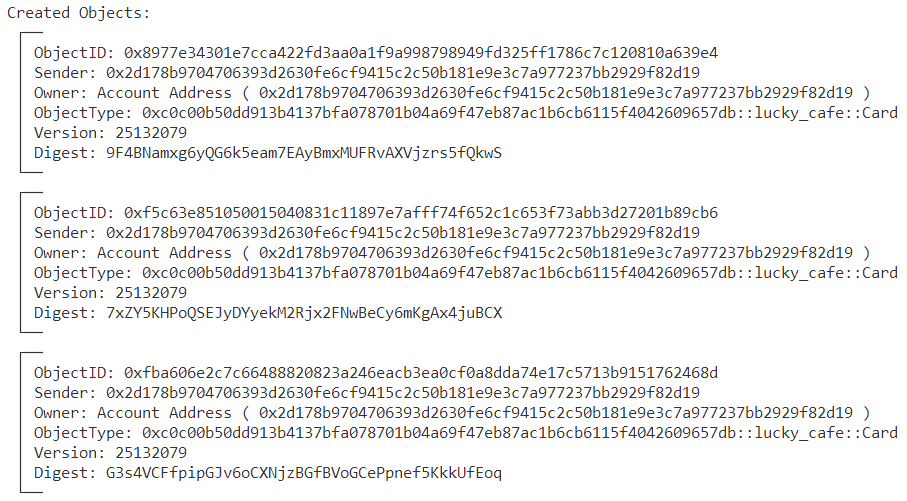
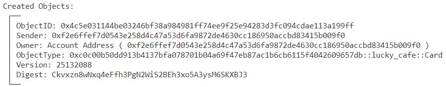
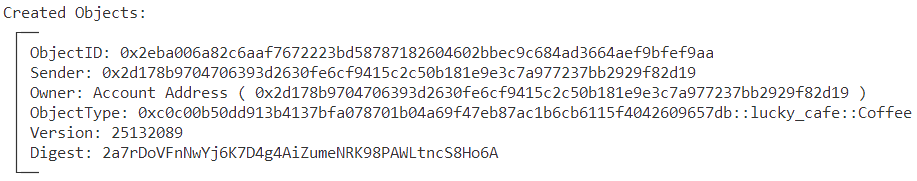
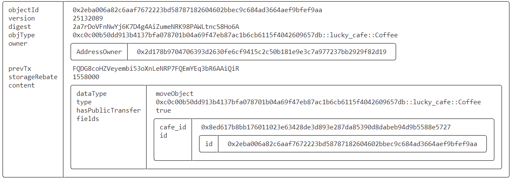
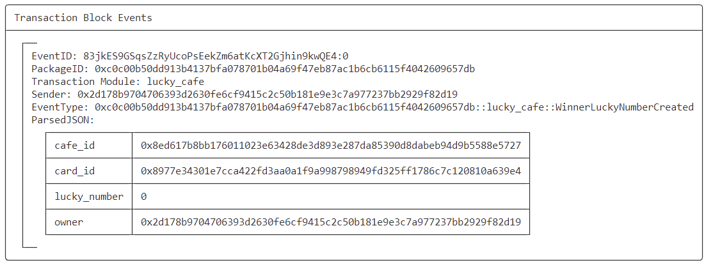
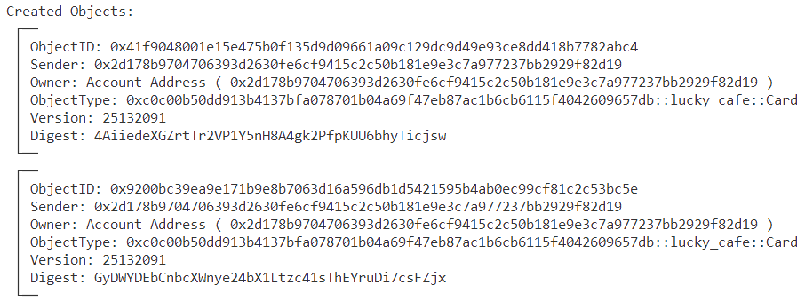

# SUI Move Lucky Cafe

## 1 Entity Definition

- Coffee Shop (`Cafe`)
- Coffee Card (`Card`)
- Coffee (`Coffee`)
- Owner (`Owner`, `Admin`)
- Customer

## 2 Entity Relationship

- Any user can create a coffee shop (`Cafe`) and become the owner (`Owner`, `Admin`)
- Customers can buy coffee cards (`Card`)
- Coffee cards (`Card`) can be exchanged for coffee (`Coffee`) on a `1:1` basis

## 3 Economic Design

- Every 5 GAS can buy a coffee card, buy two and get one free, that is, 10 GAS can buy 3 coffee cards, and so on
- A coffee Card can be exchanged for a cup of coffee, and after the coffee is exchanged, this coffee card becomes invalid
- Each coffee card has a unique lucky number (`Lucky Number`). Anyone can trigger the contract interface to randomly select a lucky number. If the selected lucky number corresponds to a used coffee card, a new lucky number can be drawn again
- The holder of the coffee card corresponding to the lucky number can use this lucky number coffee card to get a reward. The reward is to double the number of coffee cards in hand, with a single reward limit of 10 coffee cards. For example: Alice holds 4 coffee cards, one of which has a lucky number of 7. When the randomly selected lucky number is also 7, then good luck happens, `Alice` can destroy this lucky coffee card and double the number of coffee cards she holds.
- After the lucky number is drawn randomly, it cannot be drawn again until the corresponding coffee card is redeemed. However, the owner has admin rights and can delete the randomly generated lucky number so that a new lucky number can be selected, to avoid customers not claiming their rewards in time.

## 4 API Definition

- **create_cafe**: create a new cafe object with the provided base_drand_round and initializes its fields.
- **buy_cafe_card**: buy a card for the cafe object with the provided sui amount.
- **buy_coffee**: buy a coffee for the cafe object with the provided card object.
- **get_lucky_number**: get the lucky number for the cafe object with the provided drand signature.
- **get_reward_with_lucky_card**: get the reward for the more cafe object with the provided lucky card object.
- **remove_lucky_number**: remove the winner lucky number of the cafe object.
- **get_sender_card_count**: get the sender's card count of the cafe object.

## 5 Testing

### 5.1 publish contract

> switch to Jason account

- **run command**

```bash
$ sui client publish --gas-budget 100000000
```

- **important outputs**



- **record PackageID**

```bash
export PACKAGE_ID=0xc0c00b50dd913b4137bfa078701b04a69f47eb87ac1b6cb6115f4042609657db
```

### 5.2 create_cafe

- **run command**

```bash
# Obtain the current round of drand random source
export BASE_ROUND=`curl -s https://drand.cloudflare.com/52db9ba70e0cc0f6eaf7803dd07447a1f5477735fd3f661792ba94600c84e971/public/latest | jq .round`
echo $BASE_ROUND

export GAS_BUDGET=100000000
sui client call --function create_cafe --package $PACKAGE_ID --module lucky_cafe  --args $BASE_ROUND --gas-budget $GAS_BUDGET
```

- **important outputs**



- **record Cafe and Admin objecID**

```bash
export CAFE=0x8ed617b8bb176011023e63428de3d893e287da85390d8dabeb94d9b5588e5727

export ADMIN=0xc1c6278827259295249bf3d43ce0861c21960693a89b5677b175d9844eafc57c
```

### 5.3 buy_cafe_card

#### （1）Alice by cafe card

> switch to Alice account
>
> Alice spent 10 GAS, obtained 2 coffee cards, gave 1 as a reward, totaling 3 coffee cards

- **run command**

```bash
# switch to Alice account
sui client switch --address alice

# Find two large GAS objects under Alice, one for paying gas and the other for splitting out the specified number of COIN object for GAS
sui client gas --json | jq '.[] | select(.gasBalance > 100000) | .gasCoinId' -r > output.txt
GAS=$(sed -n '1p' output.txt)
SPLIT_COIN=$(sed -n '2p' output.txt)

# Split out 10 GAS for purchasing coffee card
export COIN=`sui client split-coin --coin-id $SPLIT_COIN --amounts 10 --gas $GAS --gas-budget $GAS_BUDGET --json | jq -r '.objectChanges[] | select(.objectType=="0x2::coin::Coin<0x2::sui::SUI>" and .type=="created") | .objectId'`

sui client call --function buy_cafe_card --package $PACKAGE_ID --module lucky_cafe --args $CAFE $COIN --gas-budget $GAS_BUDGET 
```

- **important outputs**



#### （2）Bob by cafe card

> switch to Bob account
>
> Bob spent 5 GAS to obtain 1 coffee card

- **run command**

```bash
# switch to Bob account
sui client switch --address bob

# Find two large GAS objects under Bob, one for paying gas and the other for splitting out the specified number of COIN object for GAS
sui client gas --json | jq '.[] | select(.gasBalance > 100000) | .gasCoinId' -r > output.txt
GAS=$(sed -n '1p' output.txt)
SPLIT_COIN=$(sed -n '2p' output.txt)

# Split out 5 GAS for purchasing coffee card
export COIN=`sui client split-coin --coin-id $SPLIT_COIN --amounts 5 --gas $GAS --gas-budget $GAS_BUDGET --json | jq -r '.objectChanges[] | select(.objectType=="0x2::coin::Coin<0x2::sui::SUI>" and .type=="created") | .objectId'`

sui client call --function buy_cafe_card --package $PACKAGE_ID --module lucky_cafe --args $CAFE $COIN --gas-budget $GAS_BUDGET 
```

- **important outputs**



#### （3）display Cafe object detail

```bash
$ sui client object $CAFE
```

- **owner => card_count**

```json
      "owner_2_card_count": {
        "type": "0x2::vec_map::VecMap<address, u64>",
        "fields": {
          "contents": [
            {
              "type": "0x2::vec_map::Entry<address, u64>",
              "fields": {
                "key": "0x2d178b9704706393d2630fe6cf9415c2c50b181e9e3c7a977237bb2929f82d19",
                "value": "3"
              }
            },
            {
              "type": "0x2::vec_map::Entry<address, u64>",
              "fields": {
                "key": "0xf2e6ffef7d0543e258d4c47a53d6fa9872de4630cc186950accbd83415b009f0",
                "value": "1"
              }
            }
          ]
        }
      },
```

- **lucky_number => owner**

```json
      "lucky_number_2_owner": {
        "type": "0x2::vec_map::VecMap<u64, address>",
        "fields": {
          "contents": [
            {
              "type": "0x2::vec_map::Entry<u64, address>",
              "fields": {
                "key": "0",
                "value": "0x2d178b9704706393d2630fe6cf9415c2c50b181e9e3c7a977237bb2929f82d19"
              }
            },
            {
              "type": "0x2::vec_map::Entry<u64, address>",
              "fields": {
                "key": "1",
                "value": "0x2d178b9704706393d2630fe6cf9415c2c50b181e9e3c7a977237bb2929f82d19"
              }
            },
            {
              "type": "0x2::vec_map::Entry<u64, address>",
              "fields": {
                "key": "2",
                "value": "0x2d178b9704706393d2630fe6cf9415c2c50b181e9e3c7a977237bb2929f82d19"
              }
            },
            {
              "type": "0x2::vec_map::Entry<u64, address>",
              "fields": {
                "key": "3",
                "value": "0xf2e6ffef7d0543e258d4c47a53d6fa9872de4630cc186950accbd83415b009f0"
              }
            }
          ]
        }
```

- **lucky_number => card_id**

```json
      "lucky_number_2_card_id": {
        "type": "0x2::vec_map::VecMap<u64, 0x2::object::ID>",
        "fields": {
          "contents": [
            {
              "type": "0x2::vec_map::Entry<u64, 0x2::object::ID>",
              "fields": {
                "key": "0",
                "value": "0x8977e34301e7cca422fd3aa0a1f9a998798949fd325ff1786c7c120810a639e4"
              }
            },
            {
              "type": "0x2::vec_map::Entry<u64, 0x2::object::ID>",
              "fields": {
                "key": "1",
                "value": "0xfba606e2c7c66488820823a246eacb3ea0cf0a8dda74e17c5713b9151762468d"
              }
            },
            {
              "type": "0x2::vec_map::Entry<u64, 0x2::object::ID>",
              "fields": {
                "key": "2",
                "value": "0xf5c63e851050015040831c11897e7afff74f652c1c653f73abb3d27201b89cb6"
              }
            },
            {
              "type": "0x2::vec_map::Entry<u64, 0x2::object::ID>",
              "fields": {
                "key": "3",
                "value": "0x4c5e031144be03246bf38a984981ff74ee9f25e94283d3fc094cdae113a199ff"
              }
            }
          ]
        }
      },
```

### 5.4 buy_coffee

> Switch to the 'Alice' account and use the coffee card with a lucky number of 1 to redeem a cup of coffee

- **run command**

```bash
sui client switch --address alice

export CARD=0xfba606e2c7c66488820823a246eacb3ea0cf0a8dda74e17c5713b9151762468d

sui client call --function buy_coffee --package $PACKAGE_ID --module lucky_cafe --args $CAFE $CARD --gas-budget $GAS_BUDGET 
```

- **important outputs**



- **obtain Coffee object**

> This' Coffee 'object can be understood as physical coffee, a credential on the chain, and can be made into NFT form



- **display current Cafe object**
  - It can be seen that the coffee card with a lucky number of 1 has been destroyed
  - Alice's number of coffee cards has decreased from 3 to 2

```json
      "lucky_number_2_card_id": {
        "type": "0x2::vec_map::VecMap<u64, 0x2::object::ID>",
        "fields": {
          "contents": [
            {
              "type": "0x2::vec_map::Entry<u64, 0x2::object::ID>",
              "fields": {
                "key": "0",
                "value": "0x8977e34301e7cca422fd3aa0a1f9a998798949fd325ff1786c7c120810a639e4"
              }
            },
            {
              "type": "0x2::vec_map::Entry<u64, 0x2::object::ID>",
              "fields": {
                "key": "2",
                "value": "0xf5c63e851050015040831c11897e7afff74f652c1c653f73abb3d27201b89cb6"
              }
            },
            {
              "type": "0x2::vec_map::Entry<u64, 0x2::object::ID>",
              "fields": {
                "key": "3",
                "value": "0x4c5e031144be03246bf38a984981ff74ee9f25e94283d3fc094cdae113a199ff"
              }
            }
          ]
        }
      },
      "lucky_number_2_owner": {
        "type": "0x2::vec_map::VecMap<u64, address>",
        "fields": {
          "contents": [
            {
              "type": "0x2::vec_map::Entry<u64, address>",
              "fields": {
                "key": "0",
                "value": "0x2d178b9704706393d2630fe6cf9415c2c50b181e9e3c7a977237bb2929f82d19"
              }
            },
            {
              "type": "0x2::vec_map::Entry<u64, address>",
              "fields": {
                "key": "2",
                "value": "0x2d178b9704706393d2630fe6cf9415c2c50b181e9e3c7a977237bb2929f82d19"
              }
            },
            {
              "type": "0x2::vec_map::Entry<u64, address>",
              "fields": {
                "key": "3",
                "value": "0xf2e6ffef7d0543e258d4c47a53d6fa9872de4630cc186950accbd83415b009f0"
              }
            }
          ]
        }
      },
      "owner": "0x5c5882d73a6e5b6ea1743fb028eff5e0d7cc8b7ae123d27856c5fe666d91569a",
      "owner_2_card_count": {
        "type": "0x2::vec_map::VecMap<address, u64>",
        "fields": {
          "contents": [
            {
              "type": "0x2::vec_map::Entry<address, u64>",
              "fields": {
                "key": "0x2d178b9704706393d2630fe6cf9415c2c50b181e9e3c7a977237bb2929f82d19",
                "value": "2"
              }
            },
            {
              "type": "0x2::vec_map::Entry<address, u64>",
              "fields": {
                "key": "0xf2e6ffef7d0543e258d4c47a53d6fa9872de4630cc186950accbd83415b009f0",
                "value": "1"
              }
            }
          ]
        }
      },
```

### 5.5 get_lucky_number

> If the lucky number has not been drawn yet, or has been drawn and claimed, anyone can draw the lucky number.

- **run command**

```bash
# Obtain current round and random number signatures
curl -s https://drand.cloudflare.com/52db9ba70e0cc0f6eaf7803dd07447a1f5477735fd3f661792ba94600c84e971/public/latest > output.txt
export CURRENT_ROUND=`jq '.round' output.txt`
export SIGNATURE=0x`jq -r '.signature' output.txt`

# get a lucky number
sui client call --function get_lucky_number --package $PACKAGE_ID --module lucky_cafe --args $CAFE $CURRENT_ROUND $SIGNATURE --gas-budget $GAS_BUDGET 
```

- **important outputs**

If the lucky number is successfully generated, an event will be thrown, and the application can listen to the event and notify the holder of the lucky coffee card to claim the reward.



- **If the lucky number has already been generated, try to get it again will result in an error, indicating that the lucky number has been generated**

```bash
Error executing transaction: Failure {
    error: "MoveAbort(MoveLocation { module: ModuleId { address: c0c00b50dd913b4137bfa078701b04a69f47eb87ac1b6cb6115f4042609657db, name: Identifier(\"lucky_cafe\") }, function: 3, instruction: 10, function_name: Some(\"get_lucky_number\") }, 3) in command 0",
}
```

### 5.6 get_reward_with_lucky_card

> The holder of the lucky coffee card drawn can claim rewards with the coffee card they hold. The current reward is to double the number of coffee cards held, but the maximum reward limit is 10

- **run command**

```bash
# Switch to Alice, as the lucky number drawn is 0, which is a coffee card owned by Alice
sui client switch --address alice

export CARD=0x8977e34301e7cca422fd3aa0a1f9a998798949fd325ff1786c7c120810a639e4

# Use the Lucky Coffee Card you hold to claim rewards
sui client call --function get_reward_with_lucky_card --package $PACKAGE_ID --module lucky_cafe --args $CAFE $CARD --gas-budget $GAS_BUDGET 
```

- **important outputs**

> Since Alice holds a total of 2 coffee cards, calling this interface will double (2 new cards will be generated) the number of coffee cards and give them to Alice



### 5.8 remove_lucky_number

> If the holder of the Lucky Coffee Card has not received the reward. The creator of the coffee shop (with `Admin` permission) can delete lucky numbers that have already been generated, so that customers can proceed with the get it again.

- **run command**

```bash
sui client call --function remove_lucky_number --package $PACKAGE_ID --module lucky_cafe --args $ADMIN $CAFE --gas-budget $GAS_BUDGET 
```
